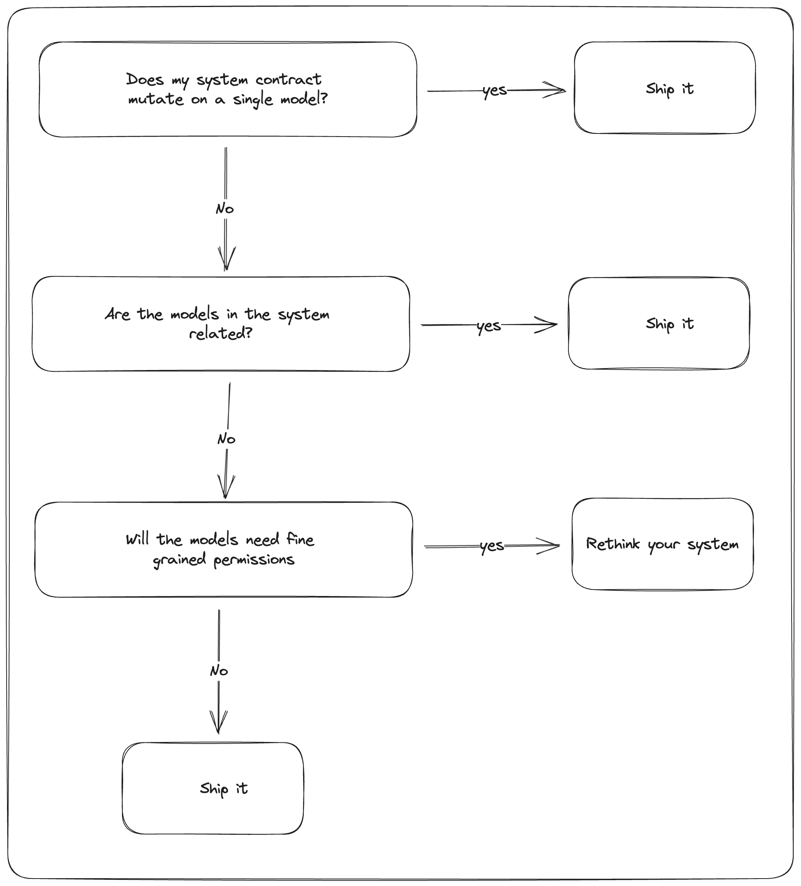

## Systems

> **IMPORTANT:** Before defining your systems, prioritize permissions. Plan carefully to ensure proper access and security.

_tldr;_
-  Systems are just contract functions
-  Contracts which contain Systems are given permissions to write to models
-  Systems pass a `world` address as their first parameter
-  Systems invoke the world contract to mutate the state of models

### What are Systems?

Within dojo we define systems as functions within a Contract that act on the world.

Systems play a pivotal role in your world's logic, directly mutating its component states. It's important to understand that to enact these mutations, a system needs explicit permission from the [`models`](./models.md) owner.

### System Permissions

Since the whole contract is giving write access to the model, it is important to be careful when defining systems. A simple way to think about it is:



### System Structure

Every system function starts with a [`world`](./world.md) address as its initial parameter. This design permits these functions to alter the world's state. Notably, this structure also makes systems adaptable and reusable across multiple worlds!

Let's look at the simplest possible system which mutates the state of the `Moves` component.

```rust,ignore
#[starknet::contract]
mod player_actions {
    use starknet::{ContractAddress, get_caller_address};
    use dojo::world::{IWorldDispatcher, IWorldDispatcherTrait};
    use dojo_examples::components::{Position, Moves, Direction, Vec2};
    use dojo_examples::utils::next_position;
    use super::IPlayerActions;

    // no storage
    #[storage]
    struct Storage {}

    // implementation of the PlayerActions interface
    #[external(v0)]
    impl PlayerActionsImpl of IPlayerActions<ContractState> {
        fn spawn(self: @ContractState, world: IWorldDispatcher) {
            let player = get_caller_address();
            let position = get!(world, player, (Position));
            set!(
                world,
                (
                    Moves { 
                        player, 
                        remaining: 10, 
                        last_direction: Direction::None(()) 
                    }
                )
            );
        }
    }
}
```

## Breaking it down

#### System is a contract

As you can see a System is like a regular Starknet contract. It can include storage, and it can implement interfaces.

#### `Spawn` function

The spawn function is currently the only function that exists in a system. It is called when a player spawns into the world. It is responsible for setting up the player's initial state.

Read more in the [sozo](../toolchain/sozo/overview.md) docs.